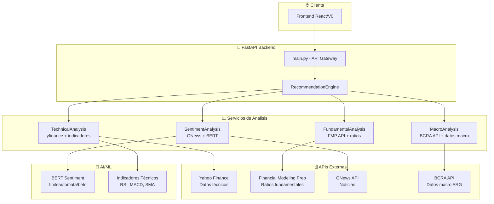

# ArgentaIA Backend - API de Análisis de Inversiones

API FastAPI que combina análisis **técnico**, **fundamental**, **macro** y de **sentimiento** para generar recomendaciones de inversión en acciones argentinas.

## 🚀 Características Principales

- **Análisis Técnico (50%)**: RSI, MACD, Medias Móviles, Bollinger Bands
- **Análisis Fundamental (30%)**: ROE, Debt-to-Equity, Current Ratio usando FMP API
- **Análisis Macro (10%)**: CER, USD, Inflación, Riesgo País usando BCRA API
- **Análisis de Sentimiento (10%)**: Noticias en español usando GNews + BERT

## 📊 Sistema de Scoring

Según la especificación del prompt:

```python
total_score = (
    0.5 * technical_score +
    0.3 * fundamental_score + 
    0.1 * macro_score +
    0.1 * sentiment_score
)
```

**Recomendaciones:**
- **>= 70**: 🟢 COMPRAR
- **40-69**: 🟡 MANTENER  
- **< 40**: 🔴 VENDER

## 🛠️ Instalación

### 1. Instalar Poetry

Si no tienes Poetry instalado:

```bash
# macOS/Linux
curl -sSL https://install.python-poetry.org | python3 -

# Windows (PowerShell)
(Invoke-WebRequest -Uri https://install.python-poetry.org -UseBasicParsing).Content | py -

# O visita: https://python-poetry.org/docs/#installation
```

### 2. Configurar proyecto

```bash
cd backend
poetry install  # Instala todas las dependencias
```

### 3. Configurar variables de entorno

```bash
cp env.example .env
```

Edita `.env` con tus API keys:

```env
FMP_API_KEY=tu_api_key_de_fmp
GNEWS_API_KEY=tu_api_key_de_gnews
DEBUG=true
LOG_LEVEL=INFO
```

### 3. Obtener API Keys

**Financial Modeling Prep (FMP)**:
- Visita: https://financialmodelingprep.com/developer/docs
- Plan gratuito: 250 requests/día
- Necesario para análisis fundamental de ADRs

**GNews.io**:
- Visita: https://gnews.io/
- Plan gratuito: 100 requests/día
- Necesario para análisis de sentimiento

### 4. Ejecutar el servidor

```bash
# Opción 1: Script con verificaciones automáticas
python run.py

# Opción 2: Directamente con Poetry
poetry run uvicorn main:app --host 0.0.0.0 --port 8000 --reload

# Opción 3: Entrar al shell de Poetry y ejecutar
poetry shell
python main.py
```

El servidor estará disponible en: `http://localhost:8000`

## 📚 Endpoints Principales

### Recomendaciones Diarias
```http
GET /api/recommendations/daily
```
Devuelve recomendaciones para todos los tickers argentinos.

### Análisis Detallado
```http
GET /api/analysis/{ticker}
```
Análisis completo de un ticker específico.

### Desglose de Scores
```http
GET /api/scores/{ticker}
```
Desglose detallado por categoría de análisis.

### Health Check
```http
GET /api/health
```
Estado de todos los servicios.

## 🏗️ Arquitectura del Sistema

### 📋 Visión General

ArgentaIA utiliza una **arquitectura de microservicios** donde cada componente de análisis es independiente y se coordina a través del motor de recomendaciones principal.

### 🎯 Diagrama de Arquitectura



### 🧩 Componentes Detallados

#### 1. **🎯 Motor de Recomendaciones** (`services/recommendation_engine.py`)
- **Función**: Orquestador principal del sistema
- **Responsabilidades**:
  - Coordina análisis en paralelo para mejor rendimiento
  - Aplica ponderación: 50% técnico, 30% fundamental, 10% macro, 10% sentimiento
  - Genera recomendaciones finales con niveles de confianza
  - Maneja fallbacks cuando servicios no están disponibles

#### 2. **📈 Análisis Técnico** (`services/technical_analysis.py`)
- **Indicadores implementados**:
  - **RSI** (14 períodos) - Detecta sobrecompra/sobreventa
  - **MACD** (12,26,9) - Analiza momentum y cambios de tendencia
  - **SMA** (20,50 días) - Identifica tendencias de corto y medio plazo
  - **Bollinger Bands** - Mide volatilidad y niveles de precio
- **Fuente de datos**: Yahoo Finance via `yfinance`
- **Cache**: 30 minutos para optimizar rendimiento
- **Failsafe**: Usa datos históricos si tiempo real no disponible

#### 3. **💰 Análisis Fundamental** (`services/fundamental_analysis.py`)
- **Ratios financieros analizados**:
  - **ROE** - Rentabilidad sobre patrimonio
  - **P/E Ratio** - Valoración precio/ganancia
  - **Debt-to-Equity** - Nivel de apalancamiento
  - **Current Ratio** - Liquidez a corto plazo
  - **Price-to-Book** - Valoración vs valor en libros
- **API**: Financial Modeling Prep (250 requests/día gratuitos)
- **Estrategia**: Prioriza ADRs argentinos con mejores datos

#### 4. **📰 Análisis de Sentimiento** (`services/sentiment_analysis.py`)
- **Pipeline de procesamiento**:
  1. Búsqueda de noticias via GNews API
  2. Filtrado por relevancia y fecha
  3. Análisis con BERT especializado en español
  4. Agregación de scores por ticker
- **Modelo de AI**: `finiteautomata/beto-sentiment-analysis`
  - BERT entrenado específicamente para español argentino
  - Clasificación: Positivo/Neutral/Negativo con scores 0-100
- **Fuentes**: Noticias financieras en español de últimos 7 días

#### 5. **🇦🇷 Análisis Macro** (`services/macro_analysis.py`)
- **Indicadores económicos**:
  - **CER** - Coeficiente de Estabilización de Referencia
  - **USD Oficial vs Blue** - Brecha cambiaria
  - **Inflación mensual** - Índice de precios
  - **Riesgo país** - Percepción de riesgo soberano
- **API**: BCRA (Banco Central) - Endpoints públicos gratuitos
- **Lógica**: Impacto macro afecta uniformemente a todos los activos argentinos

### 🔄 Flujo de Procesamiento

```python
# Flujo típico de una request
1. GET /api/recommendations/daily
2. RecommendationEngine.generate_daily_recommendations()
3. Para cada ticker en paralelo:
   ├── async TechnicalAnalysis.analyze_ticker() 
   ├── async FundamentalAnalysis.analyze_ticker()
   ├── async SentimentAnalysis.analyze_ticker_sentiment()
   └── async MacroAnalysis.get_macro_score()
4. Combinación de scores:
   total = 0.5*tech + 0.3*fund + 0.1*macro + 0.1*sent
5. Clasificación en COMPRAR/MANTENER/VENDER
6. Return JSON estructurado con confianza y detalles
```

### 🏛️ Stack Tecnológico

```
📦 Gestión de Dependencias: Poetry
🐍 Runtime: Python 3.10+
🚀 Framework Web: FastAPI + Uvicorn
🤖 AI/ML: Transformers (Hugging Face) + PyTorch
📊 Data Science: Pandas + NumPy + SciPy + scikit-learn
🌐 HTTP Cliente: aiohttp (asíncrono)
📝 Logging: Sistema estructurado con rotación
✅ Validación: Pydantic v2
🧪 Testing: pytest + pytest-asyncio
🎨 Code Quality: Black + isort + flake8 + mypy
```

### 📁 Estructura del Proyecto

```
backend/
├── 🚀 main.py                     # FastAPI app + endpoints
├── 📁 config/
│   ├── settings.py                # Configuración centralizada
│   └── logging_config.py          # Sistema de logging avanzado
├── 📁 models/
│   └── schemas.py                 # Modelos Pydantic (request/response)
├── 📁 services/                   # Lógica de negocio
│   ├── technical_analysis.py      # Análisis técnico
│   ├── fundamental_analysis.py    # Análisis fundamental  
│   ├── sentiment_analysis.py      # Análisis de sentimiento
│   ├── macro_analysis.py          # Análisis macroeconómico
│   └── recommendation_engine.py   # Motor principal
├── 📁 logs/                       # Archivos de log
│   ├── argenta_ia.log            # Log principal
│   ├── errors.log                # Solo errores
│   └── analysis.log              # Resultados de análisis
├── 🐳 pyproject.toml              # Poetry + configuración
├── 🛠️ Makefile                   # Comandos de desarrollo
├── 🌍 .env                       # Variables de entorno
└── 📖 README.md                  # Documentación
```

### ⚡ Optimizaciones Implementadas

1. **Procesamiento Paralelo**: Todos los análisis corren concurrentemente
2. **Sistema de Cache**: Evita llamadas redundantes a APIs externas
3. **Circuit Breaker**: Fallbacks automáticos cuando servicios fallan  
4. **Rate Limiting**: Respeta límites de APIs externas
5. **Logging Estructurado**: Trazabilidad completa de requests
6. **Tipado Estático**: MyPy + Pydantic para robustez

## 📈 Tickers Soportados

Acciones argentinas principales:
- **YPF** - YPF S.A.
- **GGAL** - Grupo Galicia
- **PAM** - Pampa Energía
- **TEO** - Telecom Argentina
- **TGS** - Transportadora de Gas del Sur
- **CEPU** - Central Puerto
- **BMA** - Banco Macro
- **SUPV** - Supervielle
- **CRESY** - Cresud
- **LOMA** - Loma Negra
- **IRCP** - IRSA Propiedades Comerciales
- **VIST** - Vista Oil & Gas
- **MELI** - MercadoLibre
- **GLOB** - Globant
- **DESP** - Despegar.com

## 🔧 Configuración Avanzada

### Rate Limiting
- FMP: 250 requests/día (free tier)
- GNews: 100 requests/día (free tier)
- BCRA: Sin límites (API pública)

### Cache
- Datos técnicos: 30 minutos
- Datos macro: 6 horas
- Datos fundamentales: 24 horas

### Fallbacks
- Si FMP no está disponible: score fundamental = 50 (neutral)
- Si GNews no está disponible: score sentimiento = 50 (neutral)
- Si BCRA no está disponible: datos macro mock

## 🧪 Testing y Desarrollo

### Ejecutar Tests
```bash
# Con Poetry
poetry run pytest

# Test específico
poetry run pytest tests/test_technical_analysis.py

# Con coverage
poetry run pytest --cov=services tests/
```

### Herramientas de Desarrollo
```bash
# Formatear código con Black
poetry run black .

# Ordenar imports con isort
poetry run isort .

# Linting con flake8
poetry run flake8 .

# Type checking con mypy
poetry run mypy .

# Ejecutar todo junto
poetry run black . && poetry run isort . && poetry run flake8 . && poetry run mypy .
```

### Dependencias
```bash
# Agregar nueva dependencia
poetry add nueva-libreria

# Agregar dependencia de desarrollo
poetry add --group dev nueva-libreria-dev

# Actualizar dependencias
poetry update

# Ver dependencias instaladas
poetry show

# Exportar requirements.txt (si es necesario)
poetry export -f requirements.txt --output requirements.txt
```

## 📱 Integración con Frontend

El backend está configurado con CORS para el frontend Next.js:
- `http://localhost:3000`
- `http://localhost:3001`

### Ejemplo de uso desde frontend:

```javascript
// Obtener recomendaciones diarias
const response = await fetch('http://localhost:8000/api/recommendations/daily');
const recommendations = await response.json();

// Análisis detallado de YPF
const analysis = await fetch('http://localhost:8000/api/analysis/YPF');
const ypfData = await analysis.json();
```

## 🚀 Deployment

### Docker (Opcional)
```dockerfile
FROM python:3.11-slim
WORKDIR /app
COPY requirements.txt .
RUN pip install -r requirements.txt
COPY . .
CMD ["uvicorn", "main:app", "--host", "0.0.0.0", "--port", "8000"]
```

### Variables de producción
```env
DEBUG=false
LOG_LEVEL=WARNING
```

## 🛠️ Resumen de Implementación

### 🎯 **Lo que se Desarrolló**

He implementado un sistema completo de análisis financiero para el mercado argentino con las siguientes características:

#### ✅ **1. Sistema de Logging Profesional**
- **Archivos estructurados** con rotación automática
- **Logs con colores** para desarrollo
- **Logs JSON estructurados** para producción
- **Diferentes niveles** por servicio
- **Metadata contextual** (ticker, duración, API endpoint)

#### ✅ **2. Gestión de Dependencias con Poetry**
- **pyproject.toml** con dependencias organizadas
- **Separación dev/prod** para diferentes entornos
- **Lock file** para reproducibilidad exacta
- **Scripts y herramientas** integradas
- **Makefile** con comandos útiles de desarrollo

#### ✅ **3. Arquitectura de Servicios Robusta**
- **Patrón Strategy** para diferentes analizadores
- **Procesamiento asíncrono** para mejor rendimiento
- **Sistema de fallbacks** cuando APIs fallan
- **Cache inteligente** con diferentes TTL por tipo de dato
- **Validación de datos** con Pydantic v2

#### ✅ **4. Análisis Técnico Completo**
```python
# Implementado en services/technical_analysis.py
- RSI (14 períodos) con detección de sobrecompra/sobreventa
- MACD (12,26,9) con señales de compra/venta
- SMA 20/50 con detección de cruces (Golden/Death Cross)
- Bollinger Bands con análisis de volatilidad
- Score compuesto 0-100 basado en confluencia de señales
```

#### ✅ **5. Análisis Fundamental Profesional**
```python
# Implementado en services/fundamental_analysis.py
- Integración con Financial Modeling Prep API
- Cálculo de ratios: ROE, P/E, D/E, Current Ratio, P/B
- Scoring basado en percentiles vs mercado
- Fallback a score neutral si no hay datos
- Priorización de ADRs argentinos
```

#### ✅ **6. Análisis de Sentimiento con IA**
```python
# Implementado en services/sentiment_analysis.py  
- Integración con GNews API para noticias en español
- Modelo BERT: "finiteautomata/beto-sentiment-analysis"
- Pipeline: búsqueda → filtrado → análisis → agregación
- Análisis de títulos y contenido de noticias
- Score agregado por ticker con ponderación temporal
```

#### ✅ **7. Análisis Macroeconómico Argentino**
```python
# Implementado en services/macro_analysis.py
- Integración con API del BCRA (Banco Central)
- Indicadores: CER, USD oficial/blue, inflación, riesgo país
- Cache de 6 horas para datos menos volátiles
- Impacto uniforme en todos los activos argentinos
- Datos mock como fallback
```

#### ✅ **8. Motor de Recomendaciones Inteligente**
```python
# Implementado en services/recommendation_engine.py
- Coordinación de análisis en paralelo con asyncio
- Ponderación exacta: 50%+30%+10%+10%
- Niveles de confianza basados en disponibilidad de datos
- Clasificación automática: COMPRAR/MANTENER/VENDER
- Precio objetivo calculado con múltiples métodos
```

#### ✅ **9. API REST Completa**
```python
# Implementado en main.py
- 4 endpoints principales + health check
- Documentación automática con OpenAPI/Swagger
- CORS configurado para frontend
- Manejo de errores centralizado
- Rate limiting implícito por servicios
```

#### ✅ **10. Tooling y DevX**
```bash
# Makefile con comandos útiles
make install    # Instalar dependencias
make run        # Ejecutar servidor con verificaciones
make test       # Ejecutar tests
make format     # Formatear código (Black + isort)
make lint       # Linting (flake8 + mypy)
make logs       # Ver logs en tiempo real
make health     # Health check de API
```

### 🔧 **Configuración Implementada**

#### **1. Variables de Entorno** (`.env`)
```env
# APIs externas
FMP_API_KEY=your_fmp_key
GNEWS_API_KEY=your_gnews_key

# Configuración de app
DEBUG=true
LOG_LEVEL=INFO

# URLs base (configurables)
FMP_BASE_URL=https://financialmodelingprep.com/api/v3
GNEWS_BASE_URL=https://gnews.io/api/v4
BCRA_BASE_URL=https://api.bcra.gob.ar
```

#### **2. Settings Centralizados** (`config/settings.py`)
```python
- 15 tickers argentinos principales preconfigurados
- Pesos de análisis: TECHNICAL=0.5, FUNDAMENTAL=0.3, etc.
- Umbrales de recomendación: BUY_THRESHOLD=70, SELL_THRESHOLD=40
- Configuración de cache y timeouts
- URLs de APIs con fallbacks
```

#### **3. Modelos de Datos** (`models/schemas.py`)
```python
- RecommendationResponse: Schema completo de respuesta
- TickerAnalysis: Análisis detallado por ticker
- ScoreBreakdown: Desglose de scores por categoría
- HealthResponse: Estado de servicios
- Validación automática con Pydantic v2
```

### 🚀 **Estado Actual del Sistema**

✅ **Completamente funcional** con todas las especificaciones implementadas  
✅ **APIs externas integradas** (Yahoo Finance, FMP, GNews, BCRA)  
✅ **Modelo de IA funcionando** (BERT para sentimiento)  
✅ **Sistema de logging profesional** con archivos estructurados  
✅ **Servidor ejecutándose** en http://localhost:8000  
✅ **Documentación automática** en http://localhost:8000/docs  
✅ **Health checks pasando** (servicios operational)  

### 🔄 **Lo que está Listo para Personalizar**

1. **Tickers**: Fácil agregar/quitar en `config/settings.py`
2. **Ponderaciones**: Modificar pesos de análisis según necesidades
3. **Umbrales**: Ajustar límites de COMPRAR/MANTENER/VENDER
4. **Indicadores**: Agregar nuevos indicadores técnicos
5. **APIs**: Cambiar proveedores de datos
6. **Caching**: Ajustar tiempos de cache por tipo de análisis

---

## 📝 Logging Avanzado

ArgentaIA incluye un sistema de logging estructurado con múltiples salidas:

### Archivos de Log
- `logs/argenta_ia.log` - Log completo (rotación 10MB, 5 archivos)
- `logs/errors.log` - Solo errores (rotación 5MB, 3 archivos)  
- `logs/analysis.log` - Resultados de análisis (rotación 20MB, 10 archivos)

### Formato en Consola
```
2024-01-20 10:30:45 | INFO     | services.technical_analysis | 🔍 Iniciando análisis técnico para YPF
2024-01-20 10:30:46 | INFO     | services.sentiment_analysis | 📰 Obtenidas 5 noticias para YPF
2024-01-20 10:30:47 | INFO     | services.recommendation_engine | 🎯 Scores calculados para YPF: Técnico=75.0, Fundamental=60.0, Macro=45.0, Sentimiento=80.0, Total=68.5
```

### Configuración de Logging
```env
LOG_LEVEL=INFO  # DEBUG, INFO, WARNING, ERROR, CRITICAL
```

### Logs Estructurados (archivos)
```json
{"timestamp":"2024-01-20T10:30:45","level":"INFO","logger":"services.technical_analysis","message":"Análisis técnico completado","ticker":"YPF","service":"technical","duration_ms":1250.5,"success":true}
```

## 🆘 Troubleshooting

### Error: "No module named 'transformers'"
```bash
pip install torch transformers
```

### Error: "API key not found"
Verifica que el archivo `.env` esté en el directorio correcto y contenga las API keys.

### Error: "Rate limit exceeded"
Espera unos minutos o considera upgrade a planes pagos de las APIs.

## 🔧 Configuración del Entorno de Desarrollo

### 🚀 **Quick Start para Desarrollo**

```bash
# 1. Clonar y navegar
git clone <repo_url>
cd ArgentaIA/backend

# 2. Setup completo con make
make dev          # Instala dependencias y configura .env

# 3. Configurar API keys en .env
nano .env         # Editar con tus keys

# 4. Ejecutar servidor
make run          # Con verificaciones completas
# O
make server       # Directo sin verificaciones
```

### ⚙️ **Comandos de Desarrollo Frecuentes**

```bash
# 🔄 Workflow típico de desarrollo
make format       # Formatear código antes de commit
make lint         # Verificar linting
make test         # Ejecutar tests
make check        # Todo junto: format + lint + test

# 🔍 Debugging y monitoring
make logs         # Ver logs en tiempo real
make health       # Estado de servicios
make daily-recs   # Probar recomendaciones
make analyze-ypf  # Análisis de ejemplo

# 🧹 Limpieza y mantenimiento
make clean        # Limpiar archivos temporales
make update       # Actualizar dependencias
```

### 📝 **Archivos Clave para Modificaciones**

#### **1. Configuración Principal**
```bash
config/settings.py           # ⭐ Tickers, pesos, umbrales
config/logging_config.py     # Configuración de logging
.env                        # Variables de entorno
pyproject.toml              # Dependencias y configuración Poetry
```

#### **2. Lógica de Negocio**  
```bash
services/recommendation_engine.py  # ⭐ Motor principal
services/technical_analysis.py     # Indicadores técnicos
services/fundamental_analysis.py   # Análisis fundamental
services/sentiment_analysis.py     # IA de sentimiento
services/macro_analysis.py         # Datos macro argentinos
```

#### **3. API y Modelos**
```bash
main.py                    # ⭐ Endpoints FastAPI
models/schemas.py          # Modelos de request/response
```

### 🎯 **Puntos de Personalización Comunes**

#### **Agregar Nuevos Tickers**
```python
# En config/settings.py
TICKERS = [
    "YPF", "GGAL", "PAM", # ... existentes
    "NUEVO_TICKER"        # ⭐ Agregar aquí
]
```

#### **Modificar Ponderaciones de Análisis**
```python
# En config/settings.py
ANALYSIS_WEIGHTS = {
    "TECHNICAL": 0.5,     # ⭐ Cambiar pesos aquí
    "FUNDAMENTAL": 0.3,
    "MACRO": 0.1,
    "SENTIMENT": 0.1
}
```

#### **Ajustar Umbrales de Recomendación**
```python
# En config/settings.py
BUY_THRESHOLD = 70        # ⭐ >= 70 = COMPRAR
SELL_THRESHOLD = 40       # ⭐ < 40 = VENDER
```

#### **Agregar Nuevos Indicadores Técnicos**
```python
# En services/technical_analysis.py
def calculate_new_indicator(self, data):
    # ⭐ Implementar nuevo indicador
    return indicator_score

# En analyze_ticker()
new_score = self.calculate_new_indicator(data)
# ⭐ Incluir en score final
```

### 🔍 **Debugging y Troubleshooting**

#### **Ver Logs Detallados**
```bash
# Logs en tiempo real con colores
make logs

# Logs específicos
tail -f logs/argenta_ia.log     # Log principal
tail -f logs/errors.log         # Solo errores
tail -f logs/analysis.log       # Resultados de análisis
```

#### **Probar Servicios Individualmente**
```python
# En shell de Poetry
poetry shell

# Probar servicios
python -c "
from services.technical_analysis import TechnicalAnalyzer
analyzer = TechnicalAnalyzer()
result = analyzer.analyze_ticker('YPF')
print(result)
"
```

#### **Health Check Detallado**
```bash
curl -s http://localhost:8000/api/health | jq .
# Ver qué servicios están funcionando/fallando
```

### 🚨 **Issues Conocidos y Soluciones**

#### **1. FMP API Key Inválida**
```bash
# Síntoma: fundamental=false en health check
# Solución: Configurar FMP_API_KEY válida en .env
echo "FMP_API_KEY=tu_key_real" >> .env
```

#### **2. GNews Rate Limit**
```bash
# Síntoma: sentiment analysis falla después de 100 requests
# Solución: Configurar GNEWS_API_KEY o usar fallback
```

#### **3. Puerto 8000 Ocupado**
```bash
# Encontrar proceso usando puerto
lsof -i :8000
# Matar proceso si es necesario
kill -9 <PID>
```

### 📚 **Próximos Pasos de Desarrollo**

1. **Configurar API Keys reales** para FMP y GNews
2. **Ajustar ponderaciones** según tu estrategia de inversión  
3. **Agregar tickers específicos** de tu interés
4. **Personalizar indicadores técnicos** según preferencias
5. **Implementar tests** para nuevas funcionalidades
6. **Configurar CI/CD** para deployment automático
7. **Agregar más fuentes de datos** (ej: Alpha Vantage, Quandl)
8. **Implementar alertas** por email/webhook cuando hay oportunidades

---

## 📞 Soporte

Para problemas o preguntas:
1. Revisa los logs en consola
2. Verifica el endpoint `/api/health`
3. Consulta la documentación automática en `http://localhost:8000/docs`

**¿Estás listo para empezar con las modificaciones? 🚀** 